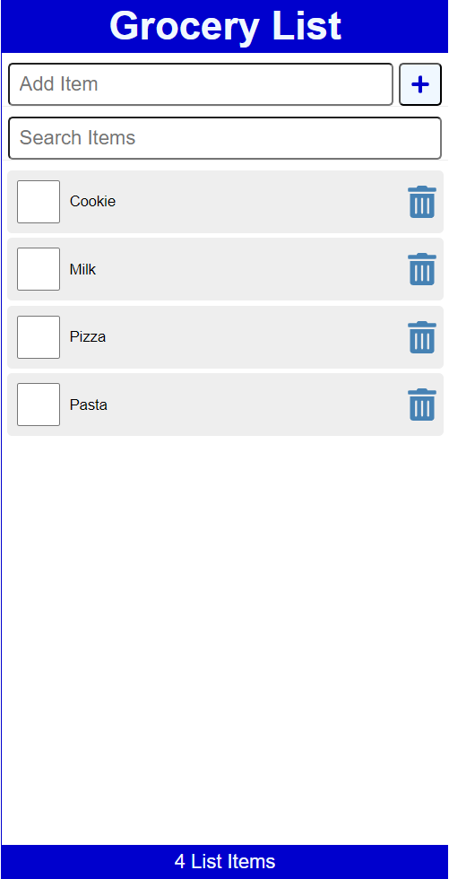
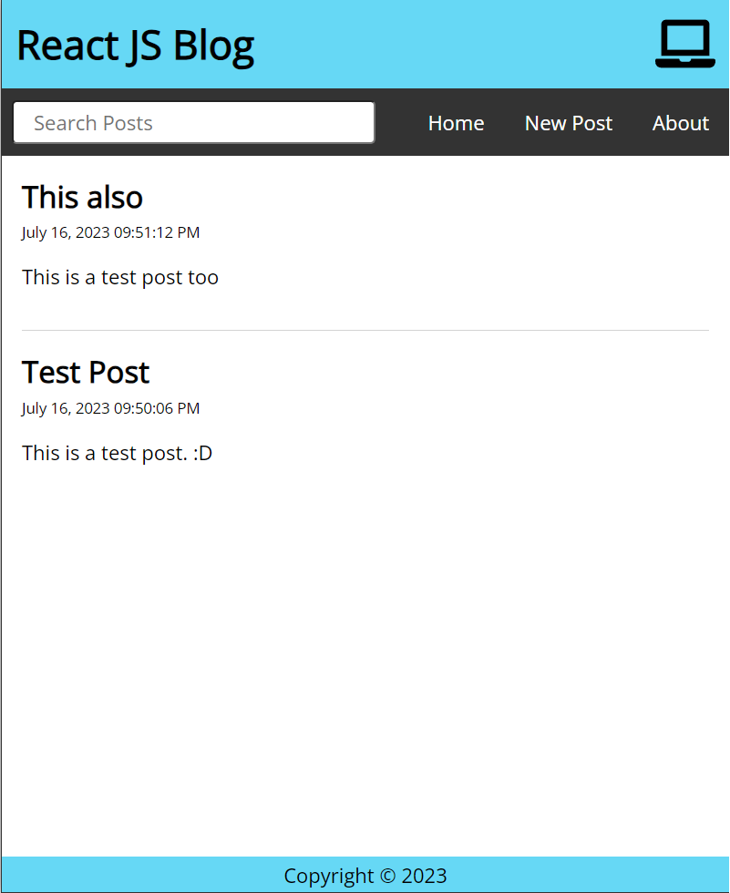
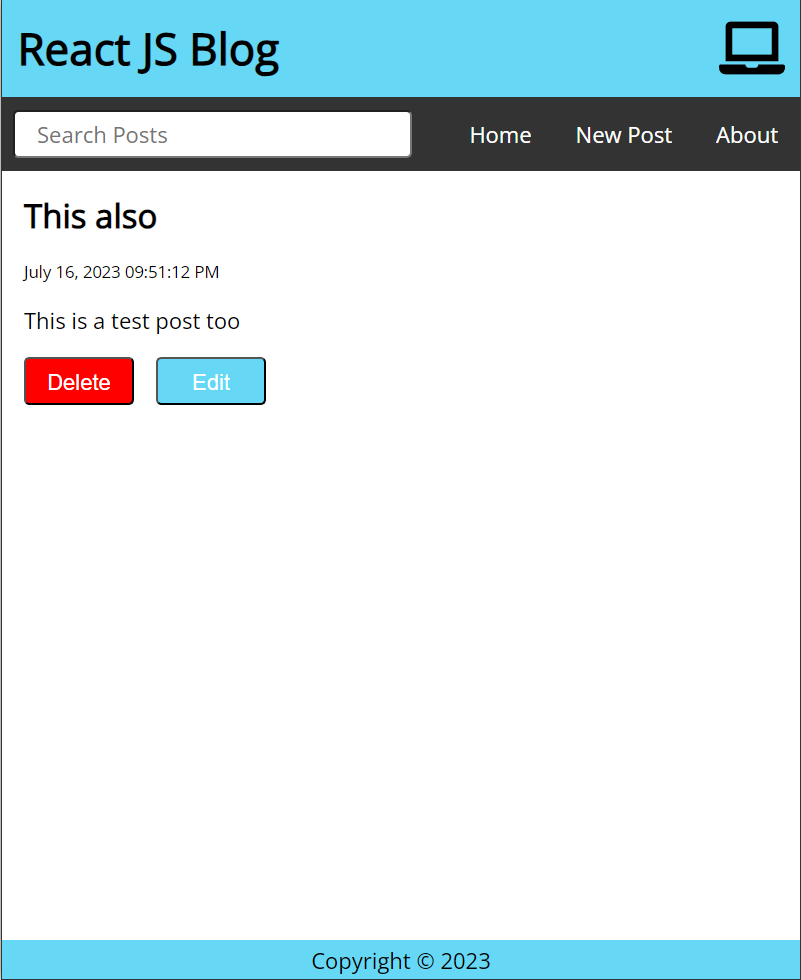
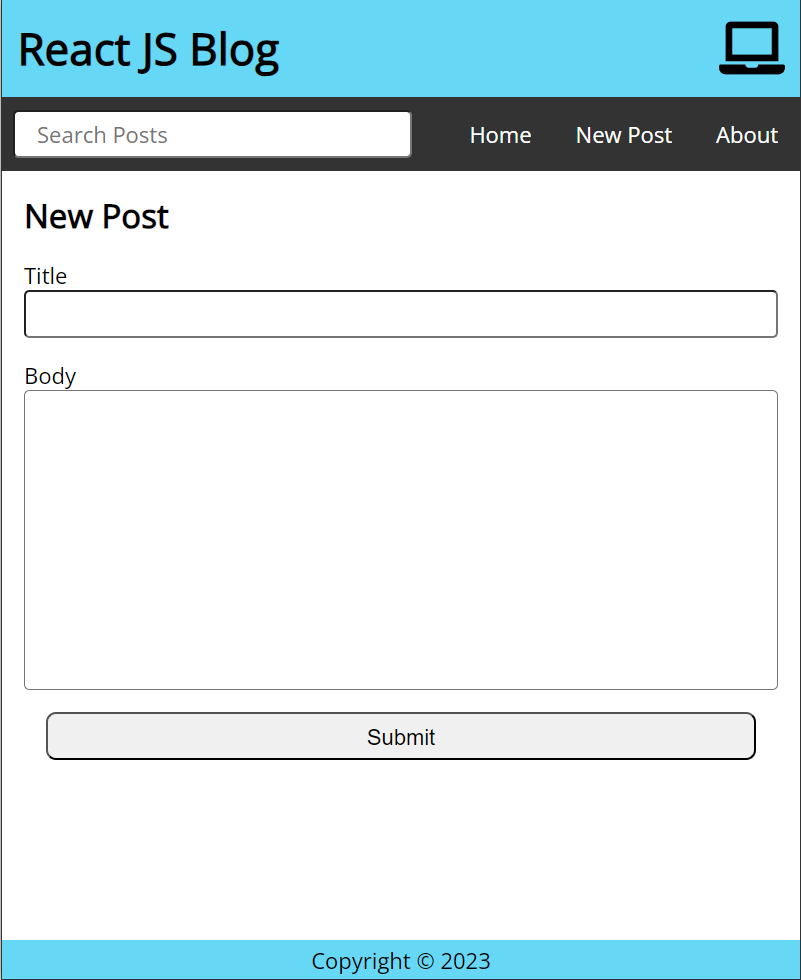
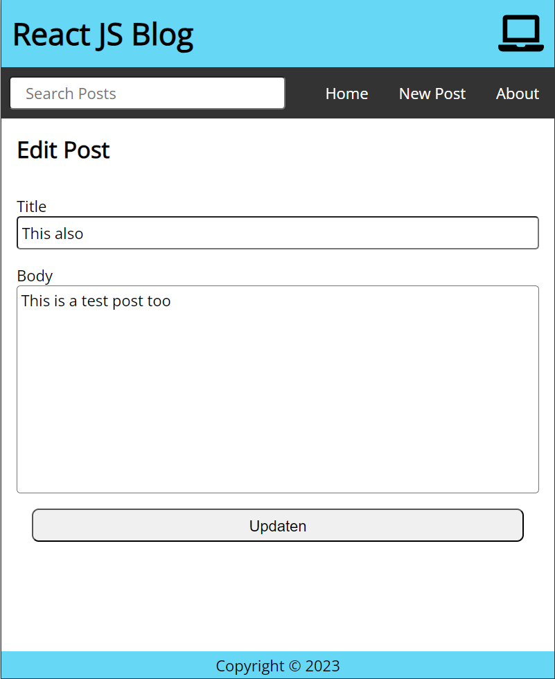

# React-Crash-Course

## Table of Contents

-   [Description](#description)
-   [Branches](#branches)
-   [Dependencies Grocery List](#dependencies-grocery-list)
-   [Dependencies Blog](#dependencies-blog)
-   [Installation Grocery List](#installation-grocery-list)
-   [Installation Blog](#installation-blog)
-   [Screenshots](#screenshots)

## Description

This is a React project that I am using to learn React. As projects are build a Groceries List and a blog. The Grocery List is a simple list of groceries that can be added and removed. The blog is a simple blog that can be used to add, updated and remove posts. Both are using a json-server as a backend.

## Branches

| Name              | Use                                                     |
| ----------------- | ------------------------------------------------------- |
| main              | The main branch that contains all chapters.             |
| Blog              | The branch that contains the Blog project.              |
| Grocery-List      | The branch that contains the Grocery List project.      |
| Fetch-Challenge   | The branch that contains the Fetch Challenge project.   |
| Project-Challenge | The branch that contains the Project Challenge project. |

## Dependencies Grocery List

| Name        | Version | Link                                               |
| ----------- | ------- | -------------------------------------------------- |
| Node.js     | 18.16.0 | [Link](https://nodejs.org/en/)                     |
| React       | 17.0.2  | [Link](https://reactjs.org/)                       |
| React Icons | 4.10.1  | [Link](https://react-icons.github.io/react-icons/) |

## Dependencies Blog

| Name             | Version | Link                                                   |
| ---------------- | ------- | ------------------------------------------------------ |
| Node.js          | 18.16.0 | [Link](https://nodejs.org/en/)                         |
| React            | 17.0.2  | [Link](https://reactjs.org/)                           |
| react-router-dom | 6.14.1  | [Link](https://www.npmjs.com/package/react-router-dom) |
| axios            | 1.4.0   | [Link](axios-http.com)                                 |
| React Icons      | 4.10.1  | [Link](https://react-icons.github.io/react-icons/)     |
| json-server      | 0.17.3  | [Link](https://www.npmjs.com/package/json-server)      |
| easy-peasy       | 6.0.1   | [Link](https://easy-peasy.now.sh/)                     |

## Installation Grocery List

1. Clone the repo

```
git clone https://github.com/niklasfulle/React-Crash-Course.git
git switch grocery-list
```

2. Install NPM packages

```
npm install
```

3. Start the json-server

```
npx json-server -p 3500 -w data/db.json
```

4. Start the app

```
npm start
```

## Installation Blog

1. Clone the repo

```
git clone https://github.com/niklasfulle/React-Crash-Course.git
```

2. Install NPM packages

```
npm install
```

3. Start the json-server

```
npx json-server -p 3500 -w data/db.json
```

4. Start the app

```
npm start
```

## Screenshots

<div id="image-table">
    <table>
      <tr>
    	    <td style="padding:10px">
        	    
              <br>
              <em>Grocery List</em>
      	    </td>
      </tr> 
	    <tr>
    	    <td style="padding:10px">
        	    
              <br>
                <em>Blog Home</em>
      	    </td>
            <td style="padding:10px">
            	
              <br>
                <em>Blog Post</em>
            </td>
        </tr>
        <tr>
    	    <td style="padding:10px">
        	    
              <br>
                <em>Blog New Post</em>
      	    </td>
            <td style="padding:10px">
            	
              <br>
                <em>Blog Edit Post</em>
            </td>
        </tr>
    </table>
</div>
